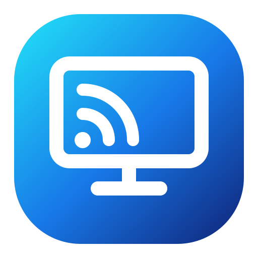

<p align="center">
  
</p>

<h1 align="center">AirMirror</h1>

<p align="center">
  iPhone 屏幕镜像到 Windows
</p>

<p align="center">
  
  
  
</p>

<p align="center">
  <strong>简体中文</strong> · <a href="./README.en.md">English</a>
</p>

---

## 简介

AirMirror 是一个给 iPhone 使用的 Windows AirPlay 接收器。它只负责把画面投到这台电脑：不录屏，不保存画面，不上传画面。

## 使用

1. 运行 `AirMirror-Setup-*.exe` 安装 AirMirror。
2. 从开始菜单打开 AirMirror，填写设备名。
3. 点击「开始接收 AirPlay」。
4. 在 iPhone 控制中心打开「屏幕镜像」，选择该设备名。

> iPhone 与电脑需要连接同一 Wi‑Fi。若网络开启设备隔离，iPhone 将无法找到电脑。

## 安装与卸载

- 安装包会创建桌面和开始菜单快捷方式。
- 可在 Windows 设置中卸载。
- 首次启动时，Windows 可能提示 Bonjour 或网络访问权限，按系统提示处理即可。

## 从源码构建

需要 Windows 和 .NET SDK 10。

```powershell
.\installer\Build-Installer.ps1 -Version 1.0.0
```

安装包会生成到 `构建\安装程序\`。`源码\` 进入 Git，`构建\` 不进入 Git。

## 许可

AirMirror 采用 [GPL-3.0](./LICENSE) 许可证。第三方内核的来源和许可证见 [第三方许可.md](./第三方许可.md)。
